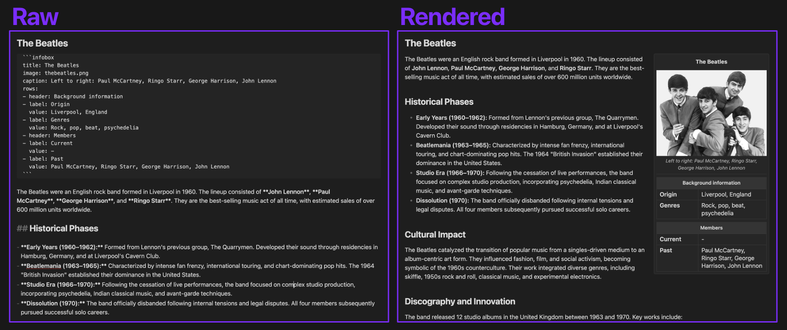

# Infobox



Plugin to render Wikipedia style infoboxes in Obsidian.

## Usage

Create a code block with the language set to `infobox` and add your infobox content inside.

```infobox
title: The Beatles
image: thebeatles.png
caption: Left to right: Paul McCartney, Ringo Starr, George Harrison, John Lennon
rows:
- header: Background information
- label: Origin
  value: Liverpool, England
- label: Genres
  value: Rock, pop, beat, psychedelia
- header: Members
- label: Current 
  value: -
- label: Past
  value: Paul McCartney, Ringo Starr, George Harrison, John Lennon
```

## Supported fields
- `title`: The title of the infobox.
- `image`: The filename of the image to display.
- `caption`: A caption for the image.
- `rows`: An array of rows to display in the infobox. Each row can be either a header or a label-value pair.
  - `header`: A header row that spans the full width of the infobox.
  - `label`: The label for a label-value pair.
  - `value`: The value for a label-value pair.


## Contributing
Contributions are welcome! Please open an issue or submit a pull request on GitHub.
